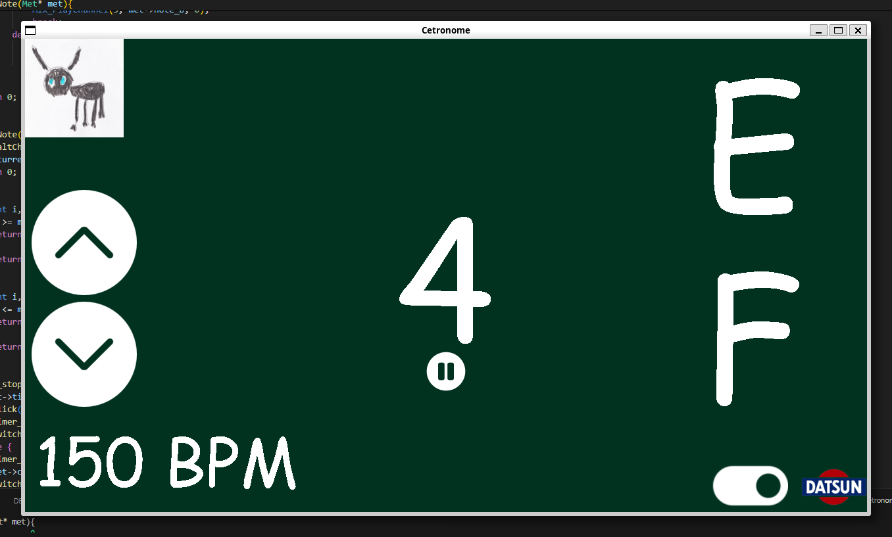

# Cetronome

It's like the [metronome](https://github.com/joshnsolomon/metronome) with the random note generator that I made in Python, but this time it's in C..

Get it? ..Cetronome

Why did I make this? idk

## Dependencies
Basically just for the system calls.

- [SDL2](https://wiki.libsdl.org/SDL2/Installation) 
- [SDL2_Image](https://wiki.libsdl.org/SDL2_image/FrontPage)
- [SDL2_TTF](https://wiki.libsdl.org/SDL2_ttf/FrontPage)
- [SDL2_Mixer](https://wiki.libsdl.org/SDL2_mixer/FrontPage)

get them however works for you.

## UI

## Differences from the other version
This version is sort of better than the Python version in the sense that the graphics are rendered on the GPU and the timer runs on a seperate thread. 
With all that said it's probably still a bit overkill. It was nice as a learning experience though. 
